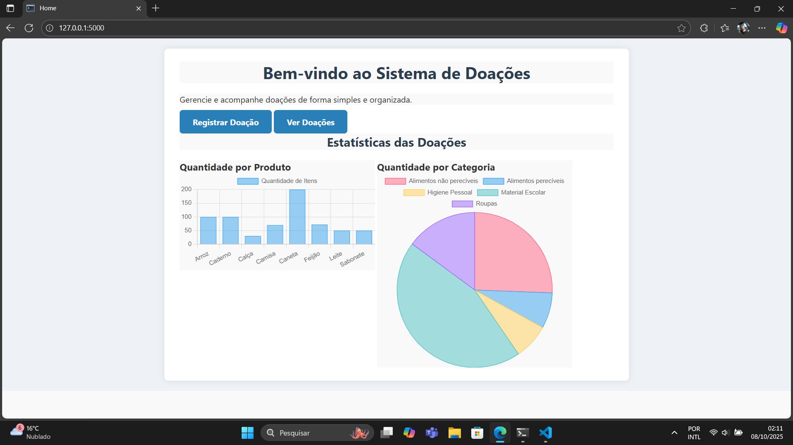
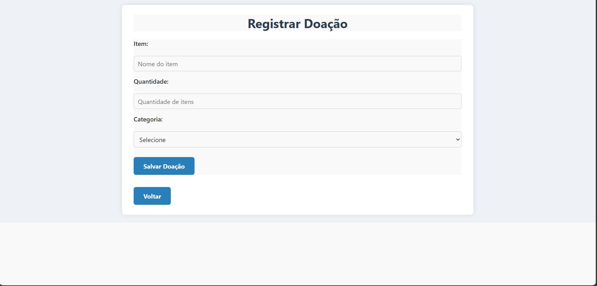
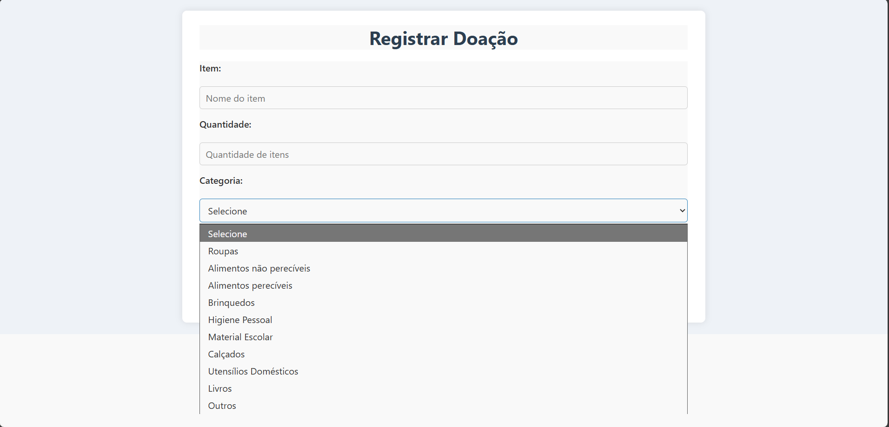
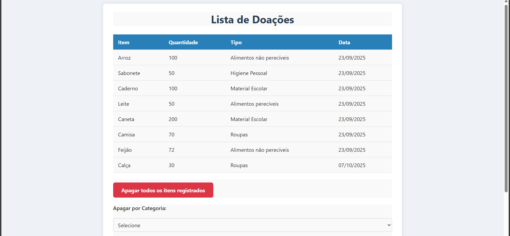
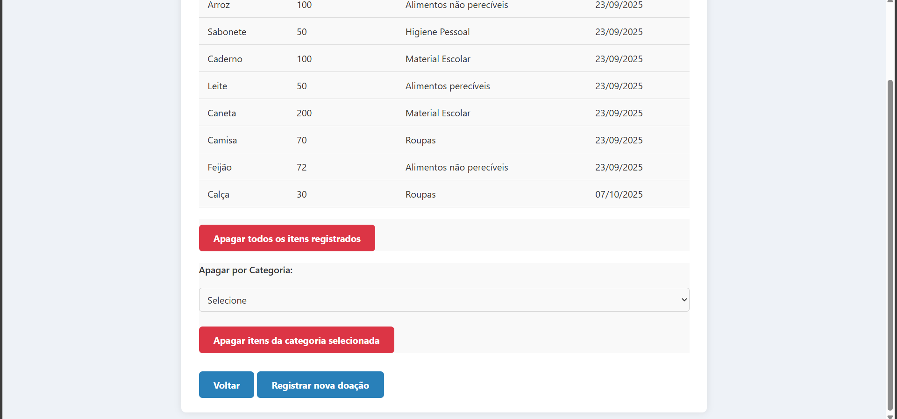
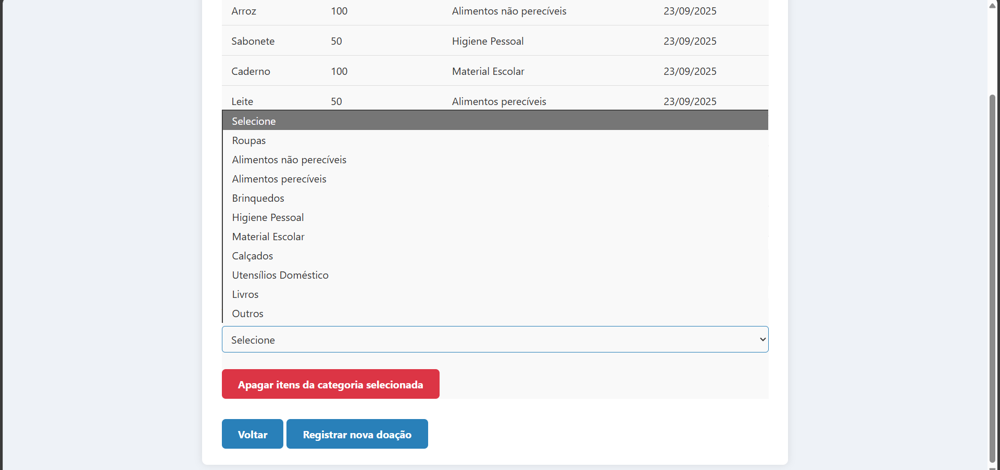

# Sistema de Gerenciamento de Doações

Este projeto tem como objetivo auxiliar instituições, ONGS e pessoas que
organizam doações de forma autônoma no gerenciamento de produtos
disponíveis para doação. Além disso, permite identificar com antecedência quais
itens estão em baixa, possibilitando a criação de
campanhas específicas para arrecadação desses produtos.

## Funcionalidades
- Página inicial com gráficos de quantidade por produto e por categoria.
- Registro de produtos para doação com nome, quantidade, categoria e data da 
doação.
- Visualização dos itens cadastrados com nome, quantidades, categoria e data de
registro.
- Exclusão de produtos por categoria.
- Exclusão de todos os produtos registrados.

## Prints da Plataforma

### Página Inicial
Gráficos da quantidade por produto e por categoria.



### Registro de Doações
Formulário para cadastrar produtos com nome, quantidade, categoria.



### Categorias disponíveis para Registro
Categorias disponíveis para seleção ao registrar um produto.



### Visualização dos Itens
Tabela com os produtos cadastrados e seus respectivos dados.



### Botões de Exclusão
Botões para exclusão por categoria ou de todos os itens.



### Categorias disponíveis para exclusão
Categorias disponíveis para seleção ao excluir itens de uma categoria específica.



## Execução e Instalação

### Pré-requisitos

- Python 3 instalado.
- Navegador web (Google Chrome, Microsoft Edge, Safari, etc.)

### Instalação

1. Clone este repositório:
    ```bash
    git clone https://github.com/Michaelluiz4/Sistema-de-controle-de-doa-o.git
    ```

2. Acesse a pasta do projeto:
cd Sistema-de-controle-de-doa-o

3. Crie e ative um ambiente virtual:
python -m venv venv
    - No Windows:
    venv\Scripts\activate

    - No macOS/Linux:
    source venv/bin/activate

4. Instale as dependências:
pip install -r requirements.txt

### Execução

1. Execute o Sistema:
python app.py

2. Acesse o Navegador:
http://localhost:5000

## Tecnologias utilizadas
- Python 3
- Flask
- HTML
- CSS3
- JavaScript
- Chart.js
- SQLite