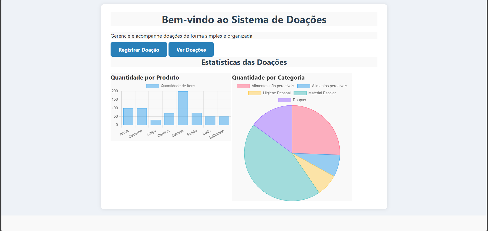

# Sistema de Gerenciamento de Doações

Este projeto tem como objetivo auxiliar instituições, ONGS e pessoas que
organizam doações de forma autônoma no gerenciamento de produtos
disponíveis para doação. Além disso, permite identificar com antecedência quais
itens estão em baixa, possibilitando a criação de
campanhas específicas para arrecadação desses produtos.

## Funcionalidades
- Página inicial com gráficos de quantidade por produto e por categoria.
- Registro de produtos para doação com nome, quantidade, categoria e data da 
doação.
- Visualização dos itens cadastrados com nome, quantidades, categoria e data de
registro.
- Exclusão de produtos por categoria.
- Exclusão de todos os produtos registrados.

## Prints da Plataforma

### Página Inicial
Gráficos da quantidade por produto e por categoria.

### Registro de Doações
Formulário para cadastrar produtos com nome, quantidade, categoria.

### Categorias disponíveis para Registro
Categorias disponíveis para seleção ao registrar produto.

